# Dependency Risk Explorer

A small web app for exploring open-source package dependency graphs and
answering a question relational schemas handle badly: **if this one
maintainer's account were compromised, what's actually exposed?**

Built on [CognoDB](https://console.cognodb.com) (openCypher over Bolt) using
the official Neo4j driver, a FastAPI backend, and a vanilla JS + D3 frontend.

---

## The use case

Every package manager (npm, PyPI, crates.io, ...) is a dependency graph:
packages depend on packages, maintainers publish packages, maintainers
belong to organizations. Recent supply-chain incidents (compromised
maintainer accounts pushing malicious versions that propagate through
thousands of downstream projects) show why the *shape* of that graph
matters as much as any single package's metadata.

This app lets someone:

1. **Explore** a package — its direct dependencies, dependents, and
   maintainers, plus a visual schematic of its 2-hop dependency
   neighborhood.
2. **Compute blast radius** — pick a maintainer and see every package that
   would be exposed, transitively, if that maintainer's credentials were
   compromised.
3. **Find the chain** between any two packages — the shortest dependency
   path connecting them, in either direction.

## Why a graph database?

The two most important queries here — **transitive dependency closure**
and **blast radius** — are variable-length, unbounded-depth traversals
over a self-referential many-to-many relationship (`Package DEPENDS_ON
Package`).

In a relational schema, both require a recursive CTE:

```sql
WITH RECURSIVE deps AS (
  SELECT to_id, 1 AS hops FROM depends_on WHERE from_id = :root
  UNION ALL
  SELECT d.to_id, deps.hops + 1
  FROM depends_on d JOIN deps ON d.from_id = deps.to_id
  WHERE deps.hops < 5  -- arbitrary cap, or the query may not terminate
)
SELECT DISTINCT to_id, MIN(hops) FROM deps GROUP BY to_id;
```

That's already awkward for one direction. Blast radius needs the *reverse*
traversal starting from a `Maintainer`, joined through `MAINTAINS` and then
back up `DEPENDS_ON` — a second recursive CTE, with its own depth cap, that
has to be kept consistent with the first. Every added hop of real-world
depth means another join tier or another recursion level to reason about,
and query plans over recursive CTEs degrade fast as the table grows.

The equivalent Cypher is one pattern, no depth bookkeeping beyond a single
safety cap, and reads like the question it's answering:

```cypher
MATCH (m:Maintainer {name: $name})-[:MAINTAINS]->(owned:Package)
MATCH (exposed:Package)-[:DEPENDS_ON*1..5]->(owned)
RETURN owned, exposed, length(path) AS hops
```

That's the concrete gain: the graph model doesn't just store the same data
differently, it makes multi-hop relationship questions the *natural* thing
to ask, instead of the thing you reach for a recursive CTE and a legal pad
to get right.

---

## Data model

```mermaid
graph LR
    M1((Maintainer)) -- MAINTAINS --> P1((Package))
    M1 -- AFFILIATED_WITH --> O1((Organization))
    P2((Package)) -- "DEPENDS_ON&#10;version_range" --> P1
    P1 -- DEPENDS_ON --> P3((Package))
```



**Nodes**
| Label | Properties |
|---|---|
| `Package` | `name` (unique), `ecosystem`, `version`, `description` |
| `Maintainer` | `name` (unique), `email` |
| `Organization` | `name` (unique) |

**Relationships**
| Type | Direction | Properties |
|---|---|---|
| `DEPENDS_ON` | `(Package)-[:DEPENDS_ON]->(Package)` | `version_range` |
| `MAINTAINS` | `(Maintainer)-[:MAINTAINS]->(Package)` | — |
| `AFFILIATED_WITH` | `(Maintainer)-[:AFFILIATED_WITH]->(Organization)` | — |

The seed dataset (`backend/seed.py`) models ~22 packages across npm and
PyPI, ~28 `DEPENDS_ON` edges (deliberately several hops deep, e.g.
`admin-dashboard → ui-components → web-router → http-fetcher → left-pad-plus`),
6 maintainers, and 3 organizations. One maintainer (`Marcus Webb`) is
deliberately given two widely-depended-on low-level packages so the blast
radius demo has something interesting to show.

---

## Project structure

```
dependency-risk-explorer/
├── backend/
│   ├── main.py          FastAPI app + routes
│   ├── db.py             Driver connection, error handling
│   ├── queries.py        Every Cypher query, parameterised
│   ├── seed.py            Idempotent seed data loader
│   ├── requirements.txt
│   └── .env.example
├── frontend/
│   ├── index.html
│   ├── style.css
│   └── app.js             D3 force graph, search, blast radius & path finder UI
└── README.md
```

---

## Setup

### 1. Create your CognoDB instance

1. Sign up at [console.cognodb.com/signup](https://console.cognodb.com/signup) (free, no card).
2. Create a free **c0** instance, pick a region. Provisioning takes under a minute.
3. Copy the `bolt+s://<instance-id>.databases.cognodb.cloud` URI and the
   one-time generated password for user `cognodb` — the password is shown
   exactly once.

### 2. Configure the backend

```bash
cd backend
python -m venv venv && source venv/bin/activate   # or your preferred env tool
pip install -r requirements.txt
cp .env.example .env
# edit .env and fill in COGNODB_URI / COGNODB_PASSWORD
```

### 3. Load seed data

```bash
python seed.py
```

You should see a line confirming how many packages, edges, maintainers,
and organizations were written. Safe to re-run — every write uses `MERGE`.

### 4. Run the app

```bash
uvicorn main:app --reload --port 8000
```

Open **http://localhost:8000** — the backend serves the frontend directly,
so there's no separate build step or dev server.

### 5. Health check

`GET /api/health` reports whether the app can currently reach CognoDB.
If the instance is unreachable or credentials are wrong, the UI shows a
banner instead of crashing, and every API route returns a clean `503`
with a human-readable reason rather than a stack trace.

---

## The main queries, explained

All queries live in `backend/queries.py` and are run through the official
driver's parameter binding (`session.run(cypher, params)`) — no string
concatenation anywhere.

- **`search_packages`** — simple case-insensitive substring match, powers
  the search-as-you-type box.
- **`get_package_overview`** — one-hop view: a package's own properties
  plus direct dependencies, dependents, and maintainers in a single query.
- **`transitive_dependencies`** *(multi-hop, 2+ hops)* — `DEPENDS_ON*1..5`
  variable-length traversal returning every package pulled in, transitively,
  with the shortest hop-count to each.
- **`blast_radius`** *(the "awkward in SQL" query)* — starts from a
  `Maintainer`, follows `MAINTAINS`, then walks `DEPENDS_ON` edges
  *backwards* with unbounded depth to find every package exposed if that
  maintainer's account were compromised. See "Why a graph database?" above.
- **`shortest_dependency_path`** — `shortestPath()` between two packages in
  either direction, for the Chain Finder tab.
- **`dependency_subgraph_nodes` / `_edges`** — nodes and edges within N hops
  of a package, shaped for the D3 force-graph visualization.

---

## Deployment

Any free-tier host works since it's a single FastAPI process serving both
API and static frontend (e.g. Render, Railway, Fly.io). Set `COGNODB_URI`,
`COGNODB_USER`, and `COGNODB_PASSWORD` as environment variables on the host
— never commit `.env`.

**Demo link:** _add your hosted URL here_
**Screen recording:** _add your recording link here_

---

## Screenshots

_Add screenshots of the Explore, Blast Radius, and Chain Finder tabs here
after running against your live CognoDB instance._
